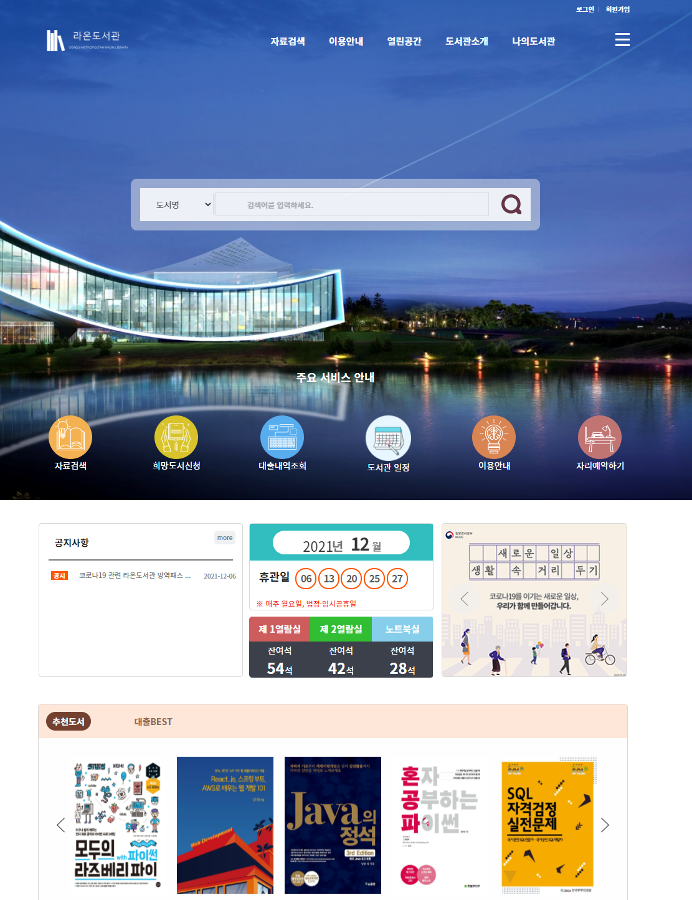
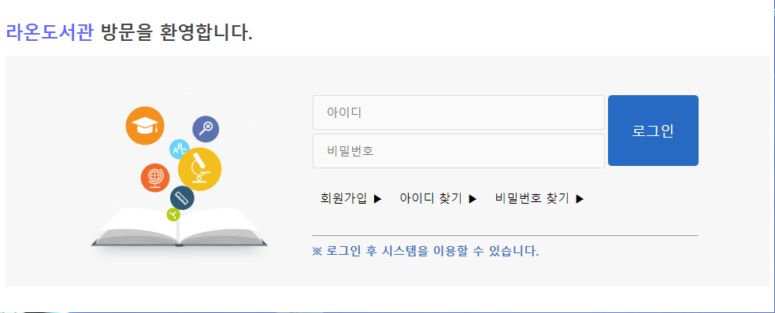
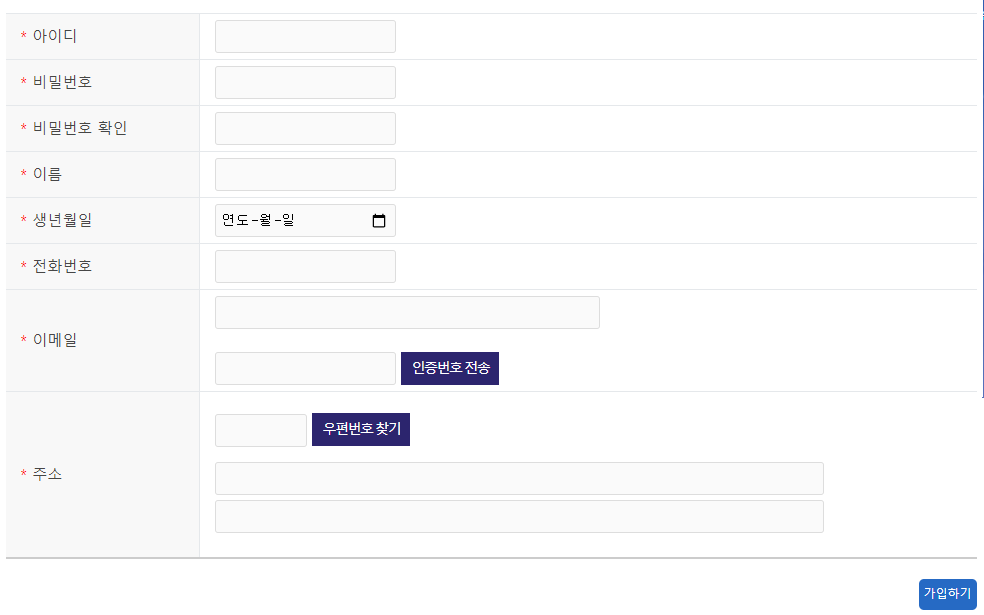
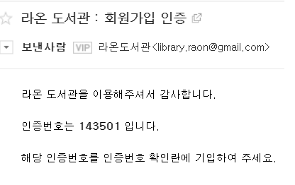
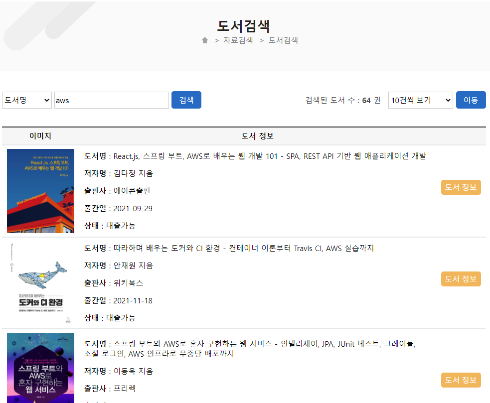
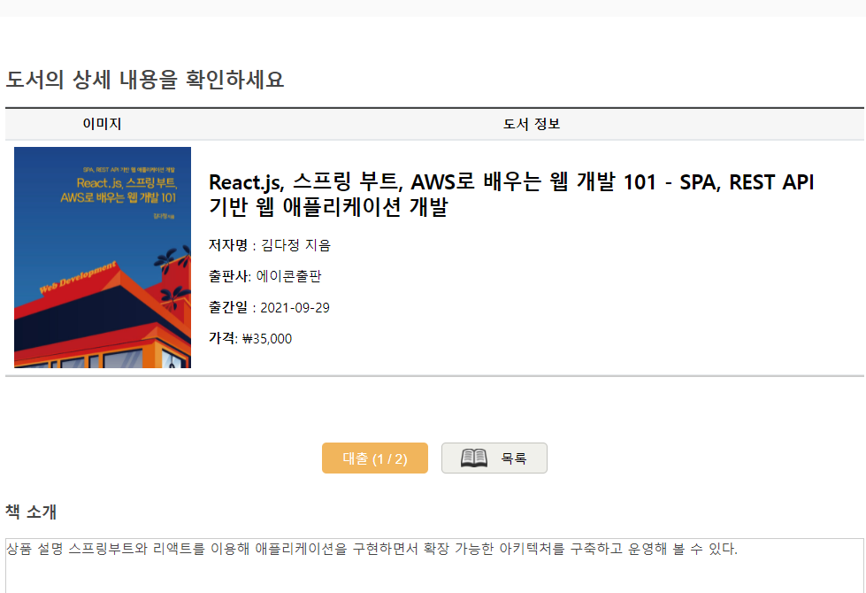
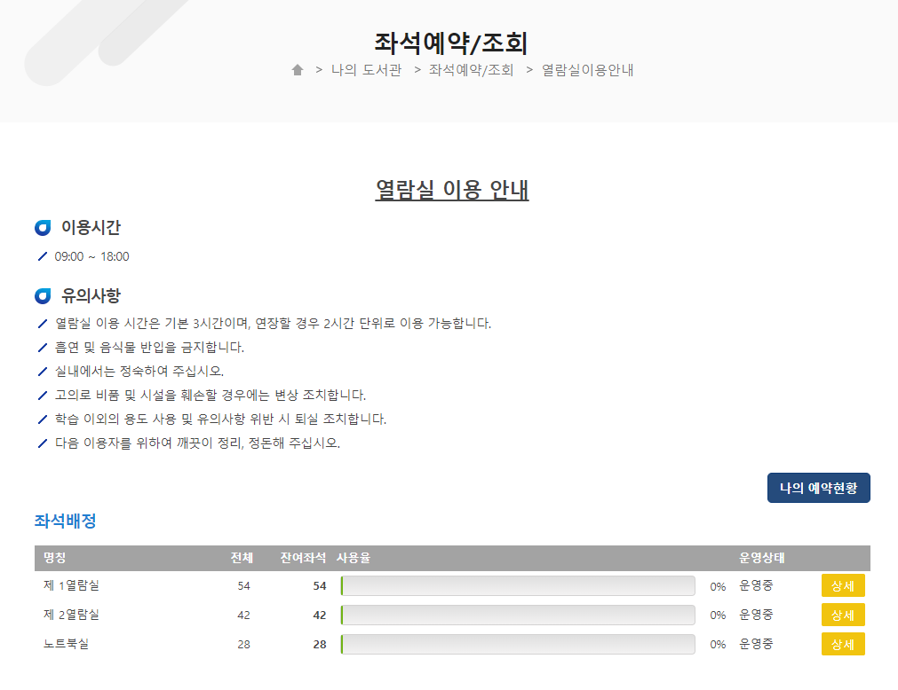
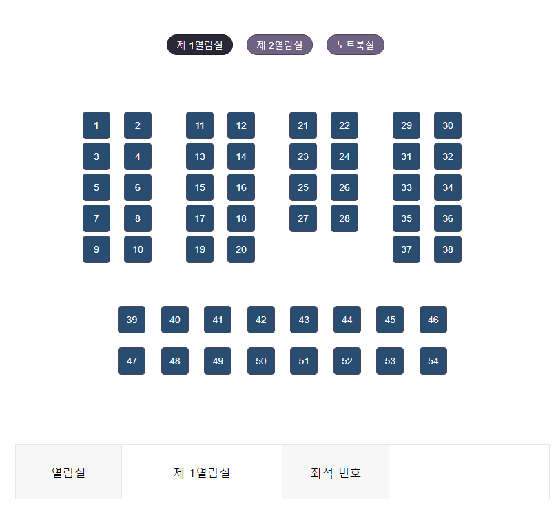
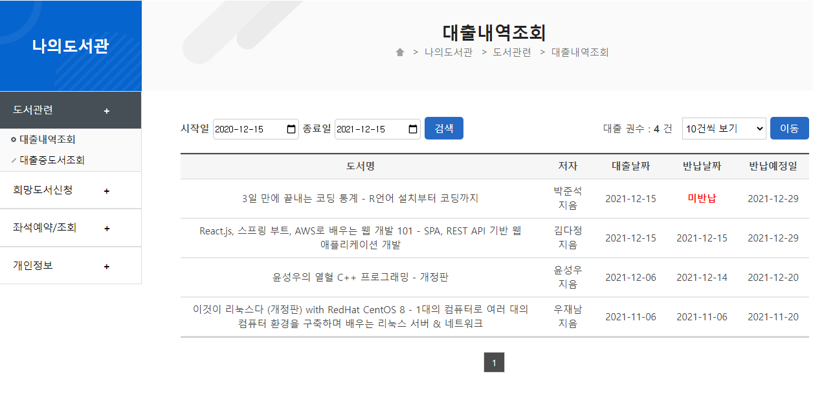
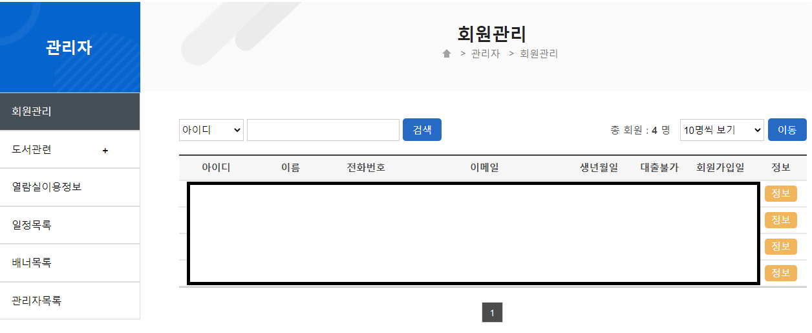

# 팀프로젝트
Spring MVC 도서관 프로젝트

## 차례

[프로젝트 소개](#프로젝트-소개)  
[주요 기능](#주요-기능)    
[외부 API](#외부-API) 

## 프로젝트 소개

Spring Framework 및 API를 활용한 도서관 제작

### 사용언어

### 개발환경

### 구성원

- 박준모 : [https://github.com/pjm529](https://github.com/pjm529)
- 김혜인 : [https://github.com/hyein29](https://github.com/hyein29)
- 신혜리 : [https://github.com/hyeri01](https://github.com/hyeri01)
- 장준화 : [https://github.com/junhwa94](https://github.com/junhwa94)
- 천종부 : [https://github.com/verita0906](https://github.com/verita0906)

### 기간

- 2021-11-03~

## 주요 기능

### 메인페이지

- 이미지 슬라이더, 그리드 레이아웃

### 로그인 & 회원가입

- 이메일 인증, 로그인 유지, 일반 회원 가입

로그인|회원가입
|---|---|
|

### 도서검색

- 알라딘 API를 이용한 도서 검색

도서검색|도서상세
|---|---|
|

### 열람실

- 열람실 예약 및 확인

열람실정보|열람실
|---|---|
|

### 마이페이지

- 대출내역, 회망도서, 열람실, 개인정보

### 관리자 페이지

- 회원관리, 도서 관련, 열람실, 일정, 배너, 관리자

## 외부 API

- 주소검색 - [KaKao 주소 API](https://postcode.map.daum.net/guide)
- 도서검색 - [Aladin API](https://www.apistore.co.kr/generalApi/generalApiView.do?general_service_seq=72)
- 찾아오는길 - [Google Map API](https://developers.google.com/maps/documentation?hl=ko)

## 참고 사이트
- 대구광역시 도서관 홈페이지
